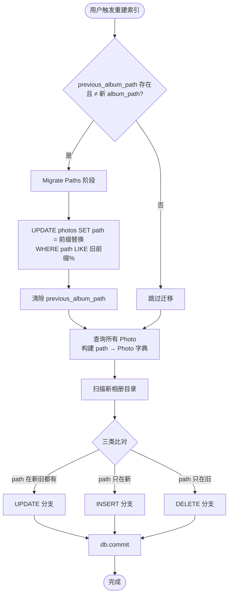

# 2026-06-28 重建索引保留收藏/相册数据方案设计

## 背景

`_rebuild_md5_index_for_album` 当前实现是「**先全删再重建**」（[backend/config_manager.py:217](file:///f:/AI/Frame_Album/backend/config_manager.py#L217) 的 `db.query(Photo).delete()`），导致：

| 数据 | 现状 |
|------|------|
| `photos.is_favorite` / `favorited_at` | **全部丢失** |
| `photos.title` / `description` | **全部丢失** |
| `album_photos` 关联（photo_id 外键） | **悬空**（新 Photo 拿到新自增 id） |
| `albums.cover_photo_id` | **悬空** |
| `albums` 表本身 | 不受影响（重建不碰这张表），但内容变空或乱指 |

两个触发入口都受影响（都调用 `_rebuild_md5_index_for_album`）：
- `PUT /api/settings/album-path`（用户切换相册路径）— [api_server.py:929-1000](file:///f:/AI/Frame_Album/backend/api_server.py#L929-L1000)
- `POST /api/settings/rebuild-index`（用户点「重建索引（数据库 + 缩略图）」按钮）— [api_server.py:1026-1106](file:///f:/AI/Frame_Album/backend/api_server.py#L1026-L1106)

前端只有一个按钮，文案 `settings.rebuildIndex` = 「重建索引（数据库 + 缩略图）」，见 [SettingsDialog.tsx:229](file:///f:/AI/Frame_Album/frontend/src/components/dialogs/SettingsDialog.tsx#L229)。点击行为：
1. 后端先清空 `~/Documents/BlurArc/thumbnails/` 下所有 `*.jpg` 缩略图缓存（[api_server.py:1043-1052](file:///f:/AI/Frame_Album/backend/api_server.py#L1043-L1052)）
2. 启动后台线程调用 `_rebuild_md5_index_for_album`（与切换相册路径走同一函数）
3. 前端轮询 `GET /api/settings/rebuild-progress/<task_id>` 显示进度

## 设计目标

### 主目标

重建索引后**保留用户的所有行为数据**：

- path 仍存在的照片：`is_favorite` / `favorited_at` / `title` / `description` / `id` 全部保留 → `album_photos` 与 `albums.cover_photo_id` 关联自然保住
- path 不存在的照片：清理该照片记录 + 相关相册关联 + 相册封面引用
- 新文件：插入新记录，默认未收藏

### 本次任务范围（P0 + P1）

| 优先级 | 任务 | 文件 | 说明 |
|--------|------|------|------|
| P0 | 重建索引增量更新 + path 迁移 | `backend/config_manager.py` + 测试 | 核心功能：保住收藏/相册数据 |
| P1 | 前端缩略图 onError 占位图 | `frontend/src/components/photos/PhotoCard.tsx` | 避免文件丢失/损坏时显示裸破图标 |

### 业务承诺（场景矩阵）

| 用户场景 | 业务行为 |
|---------|---------|
| 同一相册路径下点「重建索引」 | ✅ 完美保留所有用户数据 |
| 用户改相册根目录名（D:\Photos → D:\MyPhotos） | ✅ path 前缀迁移后保留所有数据 |
| 用户移动相册到新位置（D:\Photos → E:\Media\Photos） | ✅ 同上 |
| 重装系统盘符变化（D:\Photos → E:\Photos） | ✅ 同上 |
| 切换到完全不同相册（D:\Photos → E:\OtherAlbum） | ✅ 旧数据走 DELETE（合理，因为换相册了） |
| 用户在文件管理器删了照片 | ✅ 该照片记录和相关相册关联清掉（合理） |

### 已知限制（v1 不处理）

| 场景 | 业务行为 | 文档化 |
|------|---------|--------|
| 用户在文件管理器改名单张照片 | 旧记录走 DELETE，新记录走 INSERT，收藏丢失 | ✅ |
| 用户在文件管理器删一张 + 改名另一张为它的名字 | 收藏可能"串台"到错误照片上 | ✅ |
| 文件内容被改但 mtime 没改 | MD5 不重算，去重可能失效 | ✅（极少见） |

### 非目标（v1 不做）

- 不开启 SQLite `PRAGMA foreign_keys=ON`（影响面太大，单独评估）
- 不做 MD5 反向匹配识别"改名"场景（v2 优化方向）
- 不动 DB schema（path 字段保持绝对路径存储）
- 不动 import_manager / api_server / thumbnail_manager（P1 仅改 `PhotoCard.tsx` 一个前端文件）

## 核心策略：path 迁移 + 按绝对路径增量更新

不动 DB schema（path 仍是绝对路径），但在重建索引开头**做一次 path 前缀迁移**，让旧相册路径下的记录能匹配上新相册路径。

```
旧相册根：D:\Photos        ← 配置里记录的 previous_album_path
新相册根：D:\MyPhotos       ← 用户改名后的新路径

重建索引开头：
   UPDATE photos 
   SET path = REPLACE(path, 'D:\Photos\', 'D:\MyPhotos\') 
   WHERE path LIKE 'D:\Photos\%'

迁移后 DB 里 path 都是 D:\MyPhotos\xxx，跟新扫描路径对得上
   ↓
按绝对路径做增量更新 → 跳过未变化文件 → 收藏保留 ✅
```

### 关键不变量

- **Photo.id 永不被重置** → 所有外键（`album_photos.photo_id`、`albums.cover_photo_id`）保持有效
- **UPDATE 分支不碰 5 个保留字段** → `is_favorite / favorited_at / title / description` 完整保留
- **path 迁移只动 path 字段**，不动 photo_id → 相册关联自动保住

## 业务流程

### 流程图



### 四种场景的业务流

#### 场景 A：文件没动（占 99% 情况）

```
扫描磁盘 → path 匹配 DB 记录
        → 指纹（size + mtime）完全一致
        → 跳过，不读文件内容，不算 MD5
        → ✅ 毫秒级跳过
```

#### 场景 B：文件被改了（用户 PS 修图后覆盖原文件）

```
扫描磁盘 → path 匹配 DB 记录
        → size 或 mtime 变了
        → 重算这张照片的 MD5（只算这一张）
        → 更新文件指纹/MD5/修改时间
        → 保留 is_favorite / favorited_at / title / description / id
        → ✅ 收藏状态保留
```

#### 场景 C：文件被删了（用户在资源管理器删了照片）

```
扫描磁盘 → 该 path 在磁盘没找到
        → 走 DELETE 分支
        → Step 1: 清掉 album_photos 关联（相册「家庭」10 张 → 9 张）
        → Step 2: albums.cover_photo_id 若指向该 photo_id → 置 NULL（保留相册本身）
        → Step 3: 删 photos 记录
        → ✅ 相册本身保留，其他照片关联正常
```

#### 场景 D：文件是新的（用户从外部拷了照片进来）

```
扫描磁盘 → 该 path 在 DB 没记录
        → 走 INSERT 分支
        → 算 MD5 + 创建新记录
        → 默认未收藏、不在任何相册
        → ✅ 照片墙出现新照片
```

注意：**重建索引不做 EXIF 解析**（那是导入的活），只用文件 mtime 当 media_date。如果用户想要 EXIF 日期，应走「导入」而不是「重建」。

## 详细设计

### 1. 配置改造：记录 previous_album_path

**[backend/config_manager.py](file:///f:/AI/Frame_Album/backend/config_manager.py#L150-L184) `set_album_path_only`**

写入新 album_path 前，先把旧值挪到 `previous_album_path`：

```python
def set_album_path_only(self, album_path: str) -> bool:
    # ... 原有验证逻辑 ...
    
    album_path_abs = str(album_path_obj.absolute())
    
    # 新增：把旧 album_path 挪到 previous_album_path
    old_album_path = self.config.get("album_path")
    if old_album_path and old_album_path != album_path_abs:
        self.config["previous_album_path"] = old_album_path
    
    self.config["album_path"] = album_path_abs
    self.config["created_at"] = datetime.now().isoformat()
    # ... _save_config ...
```

### 2. 配置改造：路径失效时保留旧值

**[backend/config_manager.py](file:///f:/AI/Frame_Album/backend/config_manager.py#L267-L280) `get_album_path`**

当检测到 album_path 不存在时，**不要直接清掉**，把旧值挪到 `previous_album_path` 再置 None：

```python
def get_album_path(self) -> Optional[str]:
    album_path = self.config.get("album_path")
    if album_path:
        album_path_obj = Path(album_path)
        if not album_path_obj.exists() or not album_path_obj.is_dir():
            logger.warning(f"⚠️ 相册路径不存在或不是目录: {album_path}")
            # 把旧值挪到 previous_album_path（用于后续迁移）
            self.config["previous_album_path"] = album_path
            self.config["album_path"] = None
            self._save_config()
            return None
    return album_path
```

### 3. 重建索引改造：path 迁移 + 增量更新

**[backend/config_manager.py](file:///f:/AI/Frame_Album/backend/config_manager.py#L191-L265) `_rebuild_md5_index_for_album`**

完整重写：

```python
def _rebuild_md5_index_for_album(self, album_path: Path, progress_cb=None) -> None:
    """
    重建当前相册目录的索引（增量更新，保留用户数据）。
    
    流程：
    1) path 迁移（若相册根目录变了，把旧前缀替换成新前缀）
    2) 查询现有所有 Photo
    3) 扫描新目录媒体文件
    4) 三分支比对：
       - UPDATE：path 仍存在，按指纹判断是否重算 MD5
       - INSERT：path 是新的
       - DELETE：path 在 DB 有但磁盘没有，清掉记录 + 相册关联
    5) 保留 is_favorite / favorited_at / title / description / id
    
    Args:
        album_path: 相册根目录
        progress_cb: 可选回调 (message: str, percent: int)
    """
    def _cb(msg, pct):
        if progress_cb:
            try:
                progress_cb(msg, pct)
            except Exception:
                pass

    media_formats = MEDIA_FORMATS
    video_formats = VIDEO_FORMATS

    db = SessionLocal()
    try:
        # ============================================================
        # Phase 1: path 迁移
        # ============================================================
        prev_album_path = self.config.get("previous_album_path")
        new_album_path_abs = str(album_path.absolute()).rstrip("\\/")
        
        if prev_album_path:
            prev_abs = prev_album_path.rstrip("\\/")
            if prev_abs.lower() != new_album_path_abs.lower():
                _cb(f'检测到相册路径变化，迁移 path 前缀...', 3)
                # 严格匹配：必须以"旧前缀 + 路径分隔符"开头
                # 避免 D:\Photos 误匹配 D:\PhotosBackup
                # 用 os.sep 保证分隔符只出现一次，防止配置里末尾已带 \
                old_prefix_with_sep = prev_abs.rstrip("\\/") + os.sep
                new_prefix_with_sep = new_album_path_abs.rstrip("\\/") + os.sep
                
                # SQLite 字符串拼接：新前缀 + 旧路径去掉旧前缀的部分
                # LIKE 'D:\Photos\%' ESCAPE '\\'  避免路径中 _ 被当通配符
                # 路径里的 \ % _ 都要 escape
                def _escape_like(s):
                    return s.replace("\\", "\\\\").replace("%", "\\%").replace("_", "\\_")
                
                db.execute(
                    text(
                        "UPDATE photos "
                        "SET path = :new_prefix || SUBSTR(path, LENGTH(:old_prefix) + 1) "
                        "WHERE path LIKE :old_prefix_like ESCAPE '\\'"
                    ),
                    {
                        "new_prefix": new_prefix_with_sep,
                        "old_prefix": old_prefix_with_sep,
                        "old_prefix_like": _escape_like(old_prefix_with_sep) + "%",
                    }
                )
                db.commit()
                migrated = db.query(Photo).filter(Photo.path.like(new_prefix_with_sep + "%", escape="\\")).count()
                logger.info(f"[rebuild] path 迁移完成：{prev_abs} → {new_album_path_abs}，影响 {migrated} 条记录")
            
            # 清除 previous_album_path（迁移完成或路径没变）
            self.config["previous_album_path"] = None
            self._save_config()
        
        # ============================================================
        # Phase 2: 查询现有所有 Photo
        # ============================================================
        _cb('正在查询现有索引...', 5)
        existing_photos = db.query(Photo).all()
        existing_map = {p.path: p for p in existing_photos}
        
        # ============================================================
        # Phase 3: 扫描新目录
        # ============================================================
        _cb('正在扫描文件列表...', 10)
        all_files = [
            f for f in album_path.rglob('*')
            if f.is_file() and f.suffix.lower() in media_formats
        ]
        total = len(all_files)
        new_paths_set = {str(f) for f in all_files}
        now = datetime.now()
        
        # ============================================================
        # Phase 4: 比对 + UPDATE + INSERT
        # ============================================================
        new_photos_to_add = []
        for idx, file in enumerate(all_files, 1):
            pct = 10 + int(idx / total * 70) if total else 80
            _cb(f'正在比对 ({idx}/{total})...', pct)
            
            file_path_str = str(file)
            try:
                stat = file.stat()
            except Exception:
                continue
            
            ext = file.suffix.lower()
            file_mtime = stat.st_mtime
            
            existing = existing_map.get(file_path_str)
            if existing:
                # path 已存在 → 看指纹决定是否重算 MD5
                existing_mtime = existing.modified_at.timestamp() if existing.modified_at else None
                if existing.size == stat.st_size and existing_mtime == file_mtime:
                    # 指纹完全一致 → 跳过
                    continue
                # 指纹变了 → 重算 MD5
                existing.md5_hash = self._compute_md5(file)
                existing.size = stat.st_size
                existing.modified_at = datetime.fromtimestamp(file_mtime)
                existing.media_date = datetime.fromtimestamp(file_mtime)
                # 不动 is_favorite / favorited_at / title / description / id
            else:
                # 新文件 → 创建新 Photo
                new_photos_to_add.append(Photo(
                    filename=file.name,
                    path=file_path_str,
                    size=stat.st_size,
                    md5_hash=self._compute_md5(file),
                    created_at=now,
                    modified_at=datetime.fromtimestamp(file_mtime),
                    media_date=datetime.fromtimestamp(file_mtime),
                    file_type='video' if ext in video_formats else 'photo',
                    extension=ext,
                    imported_at=now,
                ))
        
        # ============================================================
        # Phase 5: DELETE 分支（清理已不存在文件 + 相册关联）
        # ============================================================
        _cb('正在清理已删除文件...', 85)
        to_delete_ids = [p.id for p in existing_photos if p.path not in new_paths_set]
        if to_delete_ids:
            from database import AlbumPhoto, Album
            # Step 1: 清掉 album_photos 关联
            db.query(AlbumPhoto).filter(AlbumPhoto.photo_id.in_(to_delete_ids)).delete(synchronize_session=False)
            # Step 2: albums.cover_photo_id 置 NULL（保留相册本身）
            db.query(Album).filter(Album.cover_photo_id.in_(to_delete_ids)).update(
                {Album.cover_photo_id: None}, synchronize_session=False
            )
            # Step 3: 删 photos 记录
            db.query(Photo).filter(Photo.id.in_(to_delete_ids)).delete(synchronize_session=False)
        
        # ============================================================
        # Phase 6: INSERT 新文件
        # ============================================================
        _cb('正在写入新文件...', 90)
        if new_photos_to_add:
            db.add_all(new_photos_to_add)
        
        db.commit()
        _cb('索引重建完成', 100)
        logger.info(
            f"✓ 重建索引完成: {album_path}，"
            f"共 {total} 个文件，"
            f"新增 {len(new_photos_to_add)} 个，"
            f"删除 {len(to_delete_ids)} 个"
        )
    except Exception:
        db.rollback()
        raise
    finally:
        db.close()
```

### 4. 进度回调分布

| 阶段 | 进度 |
|------|------|
| Phase 1: path 迁移 | 3-5% |
| Phase 2: 查询现有索引 | 5% |
| Phase 3: 扫描新目录 | 10% |
| Phase 4: 比对 + UPDATE/INSERT | 10-80% |
| Phase 5: DELETE 清理 | 85% |
| Phase 6: INSERT 写入 | 90% |
| 提交 | 100% |

## 影响面分析

### 修改文件清单

| 文件 | 改动 | 估计行数 |
|------|------|---------|
| [backend/config_manager.py](file:///f:/AI/Frame_Album/backend/config_manager.py) | `set_album_path_only` 加 3 行 / `get_album_path` 加 2 行 / `_rebuild_md5_index_for_album` 重写 | ~120 行 |
| [test/unit/test_config_manager_pytest.py](file:///f:/AI/Frame_Album/test/unit/test_config_manager_pytest.py#L246-L272) | 替换 `test_rebuild_md5_index` 为真实场景测试 | ~150 行 |

### 不动的清单

- `backend/database.py` schema（path 仍绝对路径，Photo/Album/AlbumPhoto 模型不变）
- `backend/api_server.py`（API 层不感知重建细节）
- `backend/import_manager.py`（导入逻辑独立）
- `backend/thumbnail_manager.py`（继续用绝对路径）
- `frontend/*`（拿到的 path 还是绝对路径）
- `backend/mobile_access_server.py`（不动）

### 入口影响

两个触发入口都自动受益（都调用同一个 `_rebuild_md5_index_for_album`）：

**入口 1：`PUT /api/settings/album-path`（切换相册路径）**

```
用户在设置里改相册路径 D:\Photos → D:\MyPhotos
       │
       ▼
set_album_path_only(D:\MyPhotos)
       │
       ├── previous_album_path = D:\Photos（新增逻辑：旧值挪过来）
       └── album_path = D:\MyPhotos
       │
       ▼
后台线程调用 _rebuild_md5_index_for_album(D:\MyPhotos)
       │
       ├── Phase 1: 检测 previous_album_path → 迁移 path 前缀 ✅
       └── Phase 2-6: 增量更新
```

**入口 2：`POST /api/settings/rebuild-index`（点重建索引按钮）**

```
用户点「重建索引（数据库 + 缩略图）」按钮
       │
       ▼
get_album_path() → 返回当前 album_path
       │  ⚠️ 若路径不存在 → 挪到 previous_album_path，置 None
       │
   ┌───┴───┐
   ▼       ▼
None    当前路径
   │       │
   ▼       ▼
报错     清空缩略图缓存
「未设置   │
 相册路径」 ▼
         后台线程调用 _rebuild_md5_index_for_album(current_path)
         │
         ├── Phase 1: previous_album_path == None → 跳过迁移
         └── Phase 2-6: 增量更新 ✅
```

**清空缩略图的副作用评估**：

| 影响项 | 是否影响方案 | 说明 |
|--------|------------|------|
| `photos` 表 | 不影响 | 清空缩略图只删文件，不动 DB |
| `is_favorite` / `album_photos` / `albums` | 不影响 | 同上 |
| 重建后用户访问照片 | 略慢 | 缩略图按需重新生成（毫秒级/张） |
| 重建索引逻辑 | 不影响 | 与方案 F 完全正交 |

**UX 边界场景（文档化）**：

用户改了相册根目录名后，**直接点重建索引按钮会报错**「未设置相册路径」，因为 `get_album_path()` 检测到旧路径不存在会置 None。用户需要先在设置里改相册路径为新的位置，才能触发 path 迁移。

> v1 接受这个 UX 限制。v2 可考虑：`rebuild_index` 端点检测到 `previous_album_path` 存在时，提示前端「检测到相册路径变化，是否需要切到新路径？」或自动尝试用 `previous_album_path` 父目录扫描。

## 反例清单

| # | 反例 | 应对 |
|---|------|------|
| 1 | 用户重建时正在导入照片 | `_rebuild_lock` 持有期间，导入 `_import_file` 不持该锁。**v1 简化**：日志 warning，不阻塞（与现状一致） |
| 2 | path 字符串大小写差异（Windows 不区分） | DB 里 path 用 `str(file.absolute())`，跟扫描时一致；LIKE 匹配时大小写不敏感（SQLite 默认 ASCII 不敏感） |
| 3 | 用户在文件管理器改名单张照片 | v1 判定为「旧 path DELETE + 新 path INSERT」，收藏丢失。文档化为已知限制 |
| 4 | 用户删一张 + 改名另一张为它的名字 | 收藏可能"串台"。文档化为已知限制（v2 加 MD5 反向匹配） |
| 5 | 文件被外部改但 mtime 没变 | MD5 不重算，去重可能失效。接受：mtime 99.9% 可靠 |
| 6 | 大相册（2 万张）单事务过大 | v1 不分批 commit（SQLite 默认隔离下读不阻塞）。若性能问题再加批 commit |
| 7 | 重建过程中其他 API 读到半成品 | SQLite DEFERRED 隔离下，未 commit 写入对其他连接不可见。OK |
| 8 | `existing.modified_at` 是 DateTime，mtime 是 float，时区不一致 | 比对用 `existing.modified_at.replace(tzinfo=None).timestamp() == file_mtime` |
| 9 | LIKE 通配符冲突（路径含 `_` 或 `%`） | ESCAPE `'\\'` + 把路径里的 `%` `_` `\` 都 escape |
| 10 | 用户改了相册根目录名后没立即在 BlurArc 改配置 | `get_album_path` 检测到不存在 → 挪到 `previous_album_path` → 用户改新路径时迁移生效 |
| 11 | `previous_album_path` 跟 `album_path` 在不同盘符（D: vs E:） | 不影响：path 迁移只做字符串替换，不关心盘符 |
| 12 | path 迁移 SQL 影响行数太多导致锁表 | 大相册（>1 万张）迁移可能锁几秒。接受：一次性开销，远比丢数据可接受 |

## P1：前端缩略图 onError 占位图

### 问题现状

[PhotoCard.tsx:90-95](file:///f:/AI/Frame_Album/frontend/src/components/photos/PhotoCard.tsx#L90-L95) 的 `` 没有 `onError` 处理：

```tsx

```

当缩略图/原图加载失败时，浏览器显示默认破图标，用户不知道发生了什么。

### 触发加载失败的场景

| # | 场景 | 后端行为 | 前端展示 |
|---|------|---------|---------|
| 1 | 原照片文件被删（DB 记录还在） | `/api/album/thumbnail` 返回 HTTP 400 | 裸破图标 |
| 2 | 原照片文件损坏（截断/不可读） | `Image.open` 抛异常，返回 HTTP 400 | 裸破图标 |
| 3 | 视频 FFmpeg 处理失败 | 生成失败，返回 HTTP 400 | 裸破图标 |
| 4 | 缩略图缓存文件本身损坏 | `send_file` 读到坏数据 | 裸破图标或 500 |

### 占位图方案

在 `PhotoCard.tsx` 增加 `onError` 兜底，用 SVG 绘制断裂图像图标，风格与项目简洁 UI 一致。

#### 新增 state 与重置逻辑

在 `const thumbnailUrl = ...` 之后新增：

```tsx
const [loadError, setLoadError] = useState(false);

useEffect(() => {
  setLoadError(false);
}, [photo.path]);
```

> 注：`Photo` 接口没有 `md5_hash` 字段，因此重置依赖只放 `photo.path`。重建索引后若该记录被删除，PhotoCard 本身不会再被渲染，所以不需要担心残留 error 状态。

#### 替换 `` 的 JSX

```tsx
{loadError ? (
  <div
    className={`w-full flex flex-col items-center justify-center bg-muted text-muted-foreground transition-transform duration-300 ${
      layoutMode === 'grid'
        ? 'aspect-square'
        : 'h-auto min-h-[160px]'
    } ${selectionMode ? '' : 'hover:scale-105'}`}
  >
    <svg
      className="w-10 h-10 mb-2"
      viewBox="0 0 24 24"
      fill="none"
      stroke="currentColor"
      strokeWidth="1.5"
      strokeLinecap="round"
      strokeLinejoin="round"
    >
      <rect x="3" y="5" width="18" height="14" rx="2" />
      <polyline points="3 15 8 11 12 14 16 10 21 14" />
      <line x1="6" y1="7" x2="18" y2="17" />
    </svg>
    <span className="text-xs">无法加载</span>
  </div>
) : (
   setLoadError(true)}
  />
)}
```

### 影响面

| 文件 | 改动 | 说明 |
|------|------|------|
| [frontend/src/components/photos/PhotoCard.tsx](file:///f:/AI/Frame_Album/frontend/src/components/photos/PhotoCard.tsx) | 加 `onError` + 占位图 JSX | 只动一个文件 |
| [frontend/src/components/photos/PhotoGrid.tsx](file:///f:/AI/Frame_Album/frontend/src/components/photos/PhotoGrid.tsx) | 不动 | 只传 photo |
| [frontend/src/components/photos/MasonryLayout.tsx](file:///f:/AI/Frame_Album/frontend/src/components/photos/MasonryLayout.tsx) | 不动 | 只传 photo |

### Masonry 布局高度说明

- 正常缩略图高度由原图宽高比决定（`h-auto object-cover`），每张卡片高度不同，形成瀑布流。
- 占位图没有原图比例，因此使用 `h-auto min-h-[160px]` 保证占位区域可见并给卡片一个确定高度。
- 对瀑布流的影响：占位图自身有确定高度，CSS 布局引擎能正常计算列高，不会导致重叠或错乱。失败卡片高度会与周围正常卡片不同，视觉上可识别为"缺失图"。

## 分步验证计划

```
1. 补单元测试（红）
   → 验证：现有重建逻辑下，收藏/相册关联丢失（红）
   → 文件：test/unit/test_config_manager_pytest.py 新增 6 个用例
       - test_rebuild_preserves_favorites
       - test_rebuild_preserves_album_associations
       - test_rebuild_preserves_title_description
       - test_rebuild_handles_deleted_files
       - test_rebuild_handles_modified_files
       - test_rebuild_migrates_path_on_album_rename

2. 实现 P0 后端改造
   → 验证：补的单元测试全绿
   → 文件：backend/config_manager.py

3. 跑全量 pytest
   → 验证：无回归（特别是 test_api_server_* 和 test_config_endpoints）

4. 手动集成测试 P0（dev 库）
   → 准备：相册 A 有 5 张照片，其中 2 张收藏，3 张在相册「家庭」里
   → 操作 1：点「重建索引」→ 验证收藏数=2、相册「家庭」仍有 3 张
   → 操作 2：删 1 张文件后重建 → 验证该照片被清理，相册「家庭」剩 2 张
   → 操作 3：改 1 张文件内容后重建 → 验证 MD5 更新、收藏仍在
   → 操作 4：改相册根目录名后重建 → 验证所有数据保留
   → 操作 5：移动相册到新位置后重建 → 验证所有数据保留

5. 实现 P1 前端占位图
   → 验证：PhotoCard.tsx 编译通过
   → 文件：frontend/src/components/photos/PhotoCard.tsx

6. 手动集成测试 P1
   → 操作 1：手动删 1 张原照片文件，刷新照片墙 → 验证显示占位图
   → 操作 2：点重建索引清掉该记录 → 验证占位图消失
   → 操作 3：检查 grid/masonry 两种布局下占位图都正常

7. 性能对比
   → 大相册（>5000 张）下重建时间，对比改前/改后
   → 预期：指纹未变场景下快 5-10 倍（不读文件内容）
```

## 验收标准

### 功能验收

| # | 验收项 | 验证方式 |
|---|--------|---------|
| 1 | 同一相册路径下重建后，所有 is_favorite 保留 | 单元测试 + 手动 |
| 2 | 重建后，所有 album_photos 关联保留（photo_id 不变） | 单元测试 + 手动 |
| 3 | 重建后，所有 albums.cover_photo_id 保留或置 NULL（指向被删照片时） | 单元测试 |
| 4 | 重建后，所有 photos.title / description 保留 | 单元测试 |
| 5 | 删 1 张文件后重建 → 该照片被清理，相关 album_photos 关联清掉，相册本身保留 | 单元测试 + 手动 |
| 6 | 改 1 张文件内容后重建 → MD5/size/mtime 更新，收藏保留 | 单元测试 + 手动 |
| 7 | 改相册根目录名后重建 → path 迁移成功，所有数据保留 | 单元测试 + 手动 |
| 8 | 移动相册到新位置后重建 → path 迁移成功，所有数据保留 | 手动 |
| 9 | 切换到完全不同相册后重建 → 旧记录走 DELETE，新文件走 INSERT | 单元测试 + 手动 |
| 10 | 重建过程中进度回调正确（5/10/85/90/100%） | 手动 |

### 性能验收

| # | 验收项 | 验证方式 |
|---|--------|---------|
| 11 | 5000 张照片未变化时重建时间 < 10 秒 | 手动 |
| 12 | 99% 文件指纹未变时，跳过 MD5 计算（验证日志） | 日志 |

### 兼容性验收

| # | 验收项 | 验证方式 |
|---|--------|---------|
| 13 | 旧版本 DB（path 绝对路径，无 previous_album_path 字段）能正常重建 | 单元测试 |
| 14 | PUT /api/settings/album-path 接口行为不变（仍异步返回 task_id） | 集成测试 |
| 15 | POST /api/settings/rebuild-index 接口行为不变（清空缩略图 + 重建） | 集成测试 |

### P1 前端验收

| # | 验收项 | 验证方式 |
|---|--------|---------|
| P1-1 | 缩略图加载失败时显示占位图，不再是裸破图标 | 手动 |
| P1-2 | 占位图与 PhotoCard 的选中状态、hover 效果不冲突 | 手动 |
| P1-3 | grid 布局下占位图占满卡片区域 | 手动 |
| P1-4 | masonry 布局下占位图高度与正常缩略图一致（不破坏瀑布流） | 手动 |
| P1-5 | 删除原照片文件后，照片墙显示占位图 | 手动 |
| P1-6 | 重建索引清掉该记录后，占位图从照片墙消失 | 手动 |

### 回归验收

| # | 验收项 | 验证方式 |
|---|--------|---------|
| 16 | 全量 pytest 通过 | `pytest` |
| 17 | 导入功能正常（新文件导入不影响） | 手动 |
| 18 | 收藏功能正常（点收藏/取消收藏） | 手动 |
| 19 | 相册 CRUD 正常（创建/重命名/删除相册） | 手动 |
| 20 | 缩略图生成正常 | 手动 |
| 21 | 前端 `npm run build` 通过 | `cd frontend && npm run build` |

## 已知限制（v1 文档化）

> **v1 重建索引的匹配规则**
> 
> - **匹配主键**：完整绝对路径字符串
> - **path 迁移**：用户切换/改名/移动相册根目录时，按字符串前缀匹配迁移 DB 里的 path
> - **保证保留**：path 完全一致的照片所有用户数据（收藏、相册、标题、描述）
> - **不保证保留**：用户在 BlurArc 外部改名单张照片导致的 path 变化
> - **推荐用法**：照片的「重命名/移动」操作应在 BlurArc 内部完成，避免外部改名
> 
> **场景行为**：
> - 同一相册路径下重建索引 → ✅ 增量更新
> - 切换相册路径（自动 path 迁移） → ✅ 保留数据（若文件结构一致）
> - 改相册根目录名 → ✅ path 迁移，保留
> - 移动相册到新位置 → ✅ path 迁移，保留
> - 重装系统盘符变化 → ✅ path 迁移，保留
> - 用户在文件管理器改名单张照片 → ❌ 旧记录 DELETE，新记录 INSERT（已知限制）
> - 用户删一张 + 改名另一张为它的名字 → ❌ 收藏可能"串台"（已知限制）
> - 相册路径从 `D:\Photos` 改为 `D:\PhotosBackup` → ⚠️ 旧记录会被迁移到 `D:\PhotosBackup\*` 下（前缀碰撞已知限制）
> 
> **v2 优化方向**：
> - UPDATE 分支加 MD5 反向匹配，识别"改名"场景并迁移用户数据
> - path 迁移增加语义判断（目录名相同/父子关系），避免前缀碰撞
> - 大相册分批 commit（避免长事务）

## 后续工作

- v2：MD5 反向匹配（识别文件改名场景）
- v2：大相册分批 commit（性能优化）
- v2：开启 SQLite `PRAGMA foreign_keys=ON`（数据完整性，单独评估）
